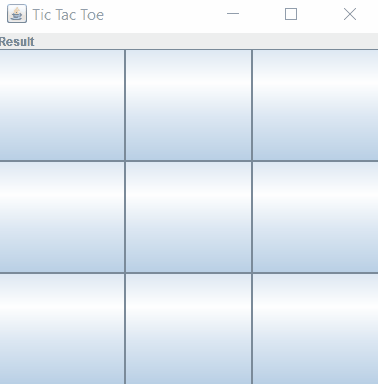

# COSC410 Tic Tac Toe

## Showcase
### Console Playthrough

### GUI Playthrough

## Tic Tac Toe
This project provides both a terminal-based and GUI-based Tic Tac Toe game. 
The files here are simply placeholders with ideas of where you might start.
In the end, your program must pass the acceptance tests `ConsoleTests.robot`
and `GuiTests.robot` found in the `src/acceptance` directory.

### Console
The console tests assume that your program accepts two numbers from the 
standard input on each turn, representing first the row and then the column 
to mark, separated by whitespace. The player representing X always goes first 
to begin the game, and it remains the current player's turn until a legal move 
is made. After a legal move is made, the turn goes to the other player.

They also assume that when you display the board as a string,
it looks like the following:

     | | 
    -----
     | | 
    -----
     | | 
    
It should be exactly 5 lines tall and 5 characters wide (not counting the 
newlines). So a board that had X winning along the diagonal would be

    X|X|O
    -----
     |X|O
    -----
    O| |X

Finally, they assume that the game ends with a winning message printed
to the console: either `"X wins"`, `"O wins"`, or `"Tie"`.

### GUI
The GUI tests assume that the GUI contains 9 buttons (ideally arranged as a
3x3 grid like a Tic Tac Toe board) and a label that will eventually hold the
result of the game. The title of the main frame of the GUI should be
`"Tic Tac Toe"`. Additionally, each button should have its name (using the
`setName` method) set to `"location00"`, `"location01"`, etc. and the label
should have its name set to `"result"`.

When the game begins, the label and all buttons are blank (no text). As the
player presses a button, if the move is legal then the button text should
be set to the appropriate mark (`"X"` or `"O"`). If the result of the game is
that the X player wins, then the result label text should be set to
`"X wins"`. If the O player wins, then the result label text should be set to
`"O wins"`. If the game ends in a tie, then the result label text should be
set to `"Tie"`. After the game has ended, no further button presses should
change the board, even on empty locations.

An example of how the GUI could look (along with the required names of
the components) is given below.

    +--------------------------------------------------+
    |   Tic Tac Toe                        | o | - | X |
    +--------------------------------------------------+
    |    ------------------------------------------    |
    |   |              JLabel: result              |   |
    |    ------------------------------------------    |
    |                                                  |
    |    ------------   ------------   ------------    |
    |   |  JButton:  | |  JButton:  | |  JButton:  |   |
    |   | location00 | | location01 | | location02 |   |
    |    ------------   ------------   ------------    |
    |    ------------   ------------   ------------    |
    |   |  JButton:  | |  JButton:  | |  JButton:  |   |
    |   | location10 | | location11 | | location12 |   |
    |    ------------   ------------   ------------    |
    |    ------------   ------------   ------------    |
    |   |  JButton:  | |  JButton:  | |  JButton:  |   |
    |   | location20 | | location21 | | location22 |   |
    |    ------------   ------------   ------------    |
    |                                                  |
    +--------------------------------------------------+

## Building the Project
After you have cloned the repository, you should be able to navigate
to the directory containing the `gradle.build` file. There, you can
build the project by running the command

`gradlew build`

You can run the acceptance tests. 

`gradlew cucumber`

Finally, you can run the unit test coverage report.

`gradlew jacocoTestReport`

When you want to get rid of all of the temporary files (like compiled 
class files and such), you can say

`gradlew clean`
 
